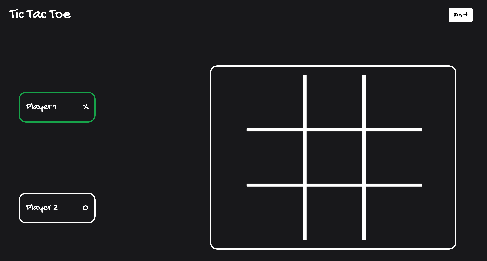
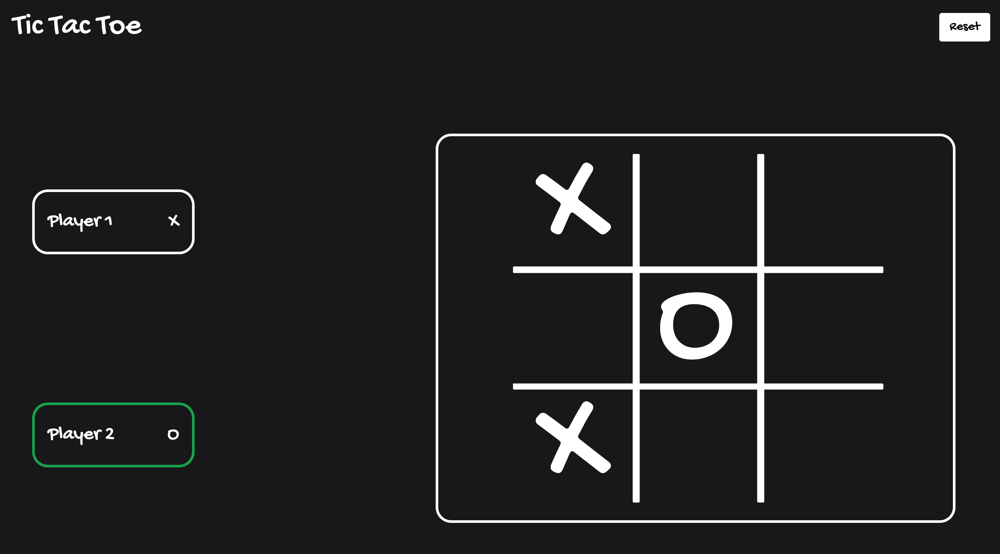
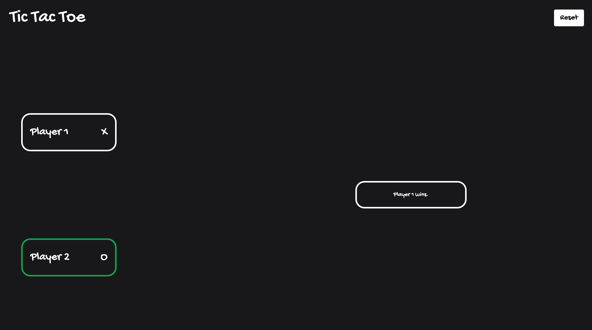

## Tic Tac Toe

This is a simple local multiplayer tic-tac-toe game developed using Next.js, TypeScript, and TailwindCSS.

To run the program:

1. Clone the project.
2. Change working directory to project directory.
3. Install dependencies by running `npm install`.
4. Run the application by running `npm run dev`.
5. Navigate to [http://localhost:3000](http://localhost:3000) in your browser to see the game.

